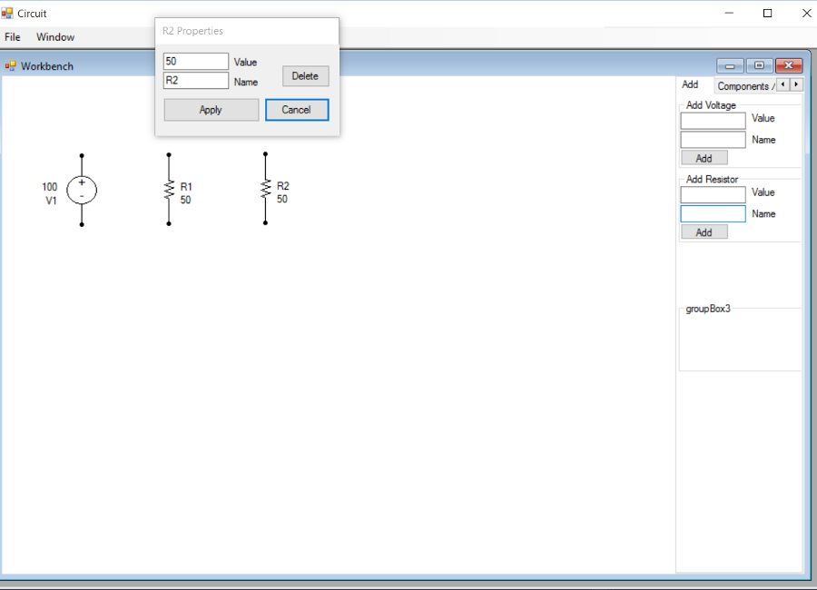

# Circuit Builder
Circuit Builder is a Simulation Program with Integrated Circuit Emphasis (**SPICE**).  
In its current form, Circuit Builder allows the user to create very simple resistive circuits which it can then run nodal analysis against to determine node voltages and currents.
## Background
The purpose of this application was for submission as a final project to my Object-Oriented Programming course. Circuit Builder is a demonstration of the cumulative knowledge gained throughout the course.  
This was found on an old machine and imported as is. The circuit component images are missing and an exception will be thrown when attempting to add components to the workbench.

My plan is to get it working without changing too much and keep it as a record of my progress.

